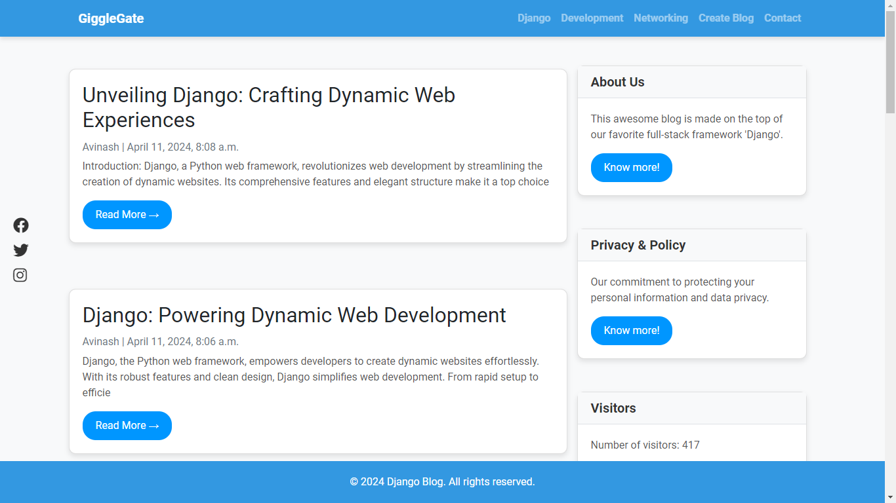
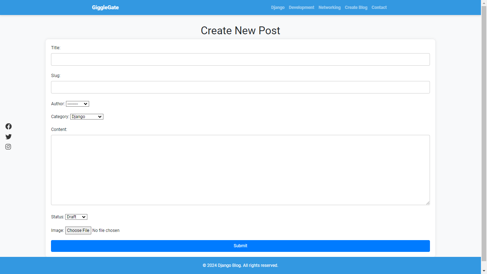

## Django Blog: A Platform for Sharing Articles

This Django-based web application serves as a platform for posting articles across various categories such as Django, Networking, and Development. Users can view existing articles, register on the platform, and create their own posts.

---

### Setup Instructions:

1. **Clone the Repository:**
   ```bash
   git clone https://github.com/AvinashAnand02/Django-Blog.git
   cd Django_Blog
   ```

2. **Install Dependencies:**
   ```bash
   pip install -r requirements.txt
   ```

3. **Apply Migrations:**
   ```bash
   python manage.py migrate
   ```

4. **Create Superuser (Optional):**
   ```bash
   python manage.py createsuperuser
   ```

5. **Run the Development Server:**
   ```bash
   python manage.py runserver
   ```

6. **Access the Application:**
   - Open your web browser and navigate to [http://127.0.0.1:8000/](http://127.0.0.1:8000/) to view the homepage.
   - Access the admin panel at [http://127.0.0.1:8000/admin/](http://127.0.0.1:8000/admin/) to manage users and articles (requires superuser credentials).

### Usage:

- **View Articles:** Users can browse articles on the homepage, categorized by Django, Networking, and Development.
- **Create Post:** Authenticated users can create new posts by filling out the "Create Post" form.
- **Contact:** Users can send messages via the contact form, accessible from the navigation bar.

### Additional Notes:

- Ensure that Django and Python are installed on your system before proceeding with the setup.
- Customize the application as needed by modifying templates, views, and models according to specific requirements.
- For production deployment, configure settings such as DEBUG, ALLOWED_HOSTS, and database settings appropriately in `settings.py`.
- Refer to Django's official documentation for detailed information on Django usage and deployment.

### Screenshots:

Here are some snapshots of the application:

1. Homepage:
   

2. Article Creation Form:
   

### Live Demo:

Check out the live demo of the application at [https://django-blog-pl3x.onrender.com/](https://django-blog-pl3x.onrender.com/).

### Author:
[Avinash Anand](https://avinashanand.me/)

### License:
This project is licensed under the [MIT License](https://opensource.org/licenses/MIT).

<h2>📬 Contact</h2>

If you want to contact me, you can reach me through below social handles.

<div align="center">

<a href="https://wa.me/7739465519" target="_blank">
  
</a> <a  href="https://www.linkedin.com/in/avinash-anand02/" target="_blank"></a>
<a href="https://twitter.com/Avinash52870643" target="_blank"></a>
<a href="mailto:avinashmgr53@gmail.com">

</div>

---
